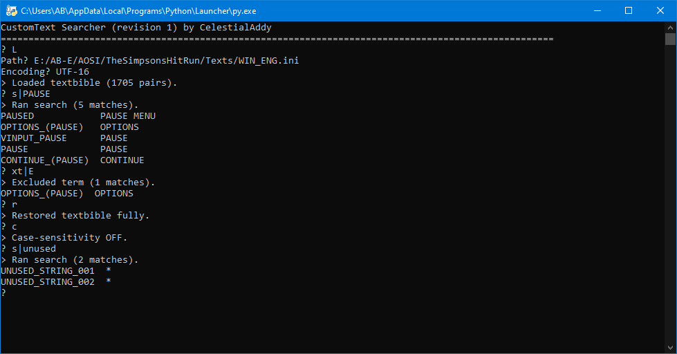

# SHR-CustomTextSearcher
Python console-UI tool for interrogating plain-text CustomText format/".ini" *The Simpsons: Hit & Run* textbibles.



## Features
- Console-based UI, supports some command line arguments.
- Supports plain-text ".ini" textbibles, either made for mods or exported from the game's P3D textbibles using Lucas' Pure3D Editor.
- Handles technicalities/edge cases (see "Technical Notes" below).
- Search for strings/texts containing or not containing terms.
- Make subsequent searches within the results pool yielded by the last search, or restore the full textbible as the scope.
- Toggleable case-sensitive search terms and results print alignment/fading.
- Output a given results pool to a plain-text file.
- Made in Python 3, can be run on any platform where there's a Python interpreter.
- Free for reuse/etc.

## Installing and Running
A Python 3 interpreter is required, see [**the Python website**](https://python.org).
  
The only required modules are included in the "Module" directory; the "sys" standard library module is imported to check for command line arguments, however failure to import it does not impede execution besides "ignoring" any command line arguments.
  
Depending on your system and how Python is installed, running the program might be as simple as double-clicking/running "CTSearcher.py".
Otherwise, you'd need to use the command line (system/setup-dependant) to run "CTSearcher.py" under your Python interpreter.

## Usage
CustomTextSearcher is an interactive console-UI program. You input operations when prompted ("?"), and results (including statement messages, errors, and operation results) are displayed in response.
```
OPERATIONS LIST
  s|STRING
	Limit results to those where the String includes STRING.
  t|TEXT
	Limit results to those where the Text includes TEXT.
  xs|STRING
	Limit results to those where the String excludes STRING.
  xt|TEXT
	Limit results to those where the Text excludes TEXT.
  L
	Load a textbible if possible. Will prompt separately for path and encoding.
	On failure, ensure the path/encoding is correct and read access is available.
  S
	Save results to a plain-text file. Will prompt separately for path and encoding.
	On failure, ensure the path/encoding is correct and write access is available.
	Fair warning: files are automatically overwritten if already present.
  R
	Restore results pool to state upon textbible load.
  N
	Prints the number of String-Text pairs in results currently.
  C
	Toggle case-sensitive s/t/xs/xt terms (default: ON).
	Prints the ON/OFF status afterwards in confirmation.
  PAD
	Toggle padding String-Text pair prints for alignment (default: ON).
	Prints the ON/OFF status afterwards in confirmation.
  CUT
	Toggle fading long Text prints for tidiness (default: ON).
	Prints the ON/OFF status afterwards in confirmation.
  X
	Exits the program.
  HELP
	Print help/usage information.
NOTES
	(1) In textbibles, String=Text.
	(2) When loading a textbible, you probably want either "UTF-16" or "UTF-8" encoding.
	    Vanilla game textbible exports from the Pure3D Editor use UTF-16.
	    Mods usually use UTF-8.
	(3) When saving a textbible, you probably want the same encoding as it loaded with.
	(4) Operation names and encodings are case-insensitive.
```
For convenience (i.e. batch/similar files), two command line arguments are supported if provided/valid:
```
python -m CTSearcher.py <InitialTextbiblePath> <InitialTextbibleEncoding>
```

## Technical Notes
- The program can technically support textbibles of any encoding also supported by the "codecs" standard library module; [**see list**](https://docs.python.org/3.13/library/codecs.html#standard-encodings).
- By design, formatting features within Texts (escapes, newlines, extra quotations, CustomText Variables, and such) are preserved and searchable/excludable - texts do not get formatted to appear as they would in-game in any sense.
- Both ";"/"#" INI-comments are supported/excluded (as the Launcher does), as well as inclusion of those characters within Texts via the "\\" escape character.
- CustomText INI sections are handled.
	- Pairs found under a "[CustomText]" section (or under no section) have no prefix added.
	- Pairs found under a level/mission/side-mission-specific section have their locality followed by "::" prefixed (i.e. "L1M2::MISSION_OBJECTIVE_00").
	- Pairs found under a "[Miscellaneous]" section are ignored entirely.
	- Pairs found under a "[Variables]" section are prefixed with "VARIABLES::".
	- Any added prefix is searchable/excludable.
- The number of results present in an output plain-text file can be calculated as "number of newline characters" or "number of lines minus one".

#
